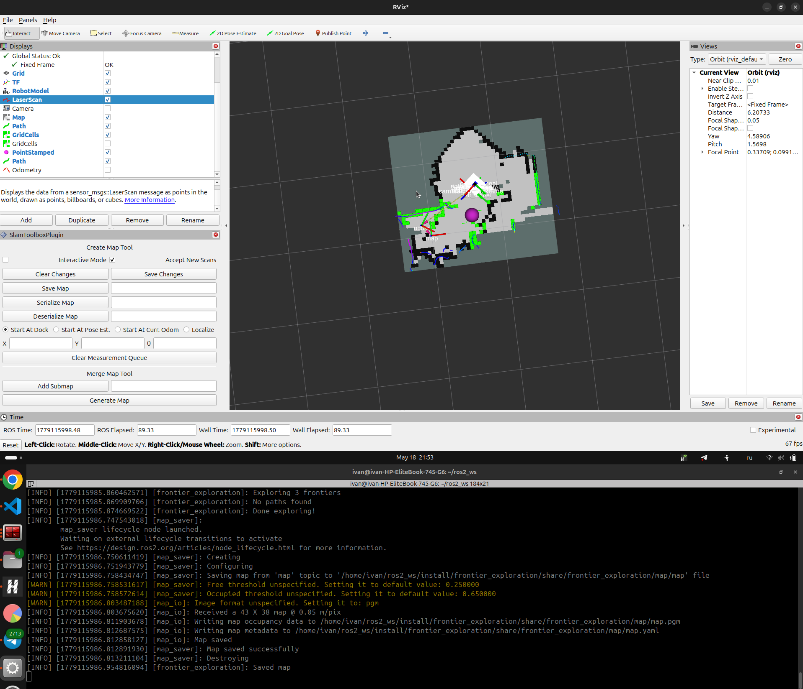

# front_explore_ros2

Автономная исследование неизвестного пространства на основе алгоритма Frontier Exploration для ROS 2 Jazzy. Пакет реализует полный стек навигации без использования Nav2 — собственный поиск фронтиров, планировщик пути A* и контроллер Pure Pursuit.

---


Список параметров:
 - MIN_FRONTIER_SIZE
---

## Параметры

`frontier_exploration`:
| Параметр                        | Значение по умолчанию | Описание                                                                                                                                                                                                                                             |
|---------------------------------|-----------------------|------------------------------------------------------------------------------------------------------------------------------------------------------------------------------------------------------------------------------------------------------|
| debug                           | false                 | Режим отладки<br>true  → публикует /frontier_cells, /cost_map, /cspace и т.д.<br>false → минимум топиков,                                                                                                                                            |
| num_explore_fails_before_finish | 60                    | Условия завершения исследования<br>Сколько раз подряд "нет фронтиров" или "нет пути" перед<br>тем как объявить карту полностью исследованной.<br>Увеличь если SLAM медленный и карта строится долго.<br>Уменьши если хочешь быстрее останавливаться. |
| min_map_cells                   | 300                   | Минимальный размер карты (ширина * высота клеток) перед<br>стартом исследования. При запуске SLAM карта маленькая<br>и почти вся -1 — фронтиров нет. Ждём пока карта вырастет.                                                                       |
| min_frontier_size               | 3                     | Параметры поиска фронтиров<br>Минимальное количество клеток во фронтире.<br>Уменьши до 1-2 если карта маленькая и фронтиры не находятся.<br>Увеличь до 8-10 чтобы игнорировать шумовые пиксели карты.                                                |
| max_frontiers_to_check          | 8                     | Сколько лучших фронтиров (по размеру) проверять через A*.<br>Увеличь до 15-20 если пропускает хорошие фронтиры.<br>Уменьши если A* работает медленно (маломощный компьютер).                                                                         |
| a_star_cost_weight              | 10.0                  | Веса стоимости при выборе фронтира<br>cost = a_star_weight * a_star_cost + size_weight / frontier_size<br>a_star_cost_weight: увеличь → предпочитать БЛИЖНИЕ фронтиры<br>                     уменьши → расстояние менее важно                       |
| frontier_size_cost_weight       | 1.0                   | frontier_size_cost_weight: увеличь → предпочитать БОЛЬШИЕ фронтиры<br>                             уменьши → размер менее важен                                                                                                                      |
| exploration_rate                | 2.0                   | Частота цикла исследования<br>2 Гц достаточно — BFS тяжёлая операция.<br>Увеличь до 5 если карта меняется быстро.                                                                                                                                    |


---

## Структура пакетов

```
front_explore_ros2/
├── frontier_msgs/          # Кастомные сообщения
└── frontier_exploration/   # Основной пакет
```

### frontier_msgs

Содержит два кастомных сообщения:

| Сообщение | Поля | Описание |
|---|---|---|
| `Frontier.msg` | `int32 size`, `geometry_msgs/Point centroid` | Один фронтир — граница между изведанным и неизведанным пространством |
| `FrontierList.msg` | `Frontier[] frontiers` | Список найденных фронтиров |

---

## Алгоритмы

### 1. Frontier Search (`frontier_search.py`)

Поиск фронтиров методом обхода в ширину (BFS) по occupancy grid. Фронтир — это клетка с неизвестным значением (`-1`), у которой есть хотя бы один свободный сосед. Соседние фронтирные клетки группируются в единый объект `Frontier` с центроидом и размером. Фронтиры меньше 8 клеток отфильтровываются.

### 2. Path Planner / A* (`path_planner.py`)

Планировщик пути на основе A* с двумя слоями стоимости:

- **C-Space** — расширение препятствий на 5 клеток через морфологическую дилатацию (OpenCV), чтобы робот не задевал стены
- **Cost Map** — карта стоимости на основе расстояния от стен: путь предпочитает центры коридоров

### 3. Frontier Exploration (`frontier_exploration.py`)

Главный узел исследования. На каждой итерации:
1. Получает позицию робота через TF (`map → base_footprint`)
2. Запускает Frontier Search от текущей позиции
3. Выбирает топ-8 фронтиров по размеру
4. Запускает A* к каждому фронтиру
5. Выбирает путь с минимальной стоимостью: `cost = 10 * a_star_cost + 1 / frontier_size`
6. Публикует лучший путь в `/pure_pursuit/path`
7. Завершает исследование если 30 раз подряд не найдено ни фронтиров, ни пути

### 4. Pure Pursuit (`pure_persuit.py`)

Контроллер следования по пути. Вычисляет команды скорости по геометрии lookahead-точки на пути. Дополнительно содержит модуль объезда препятствий — взвешенное отталкивание от стен в поле зрения робота.

---

## Топики

### Подписки

| Топик | Тип | Узел | Описание |
|---|---|---|---|
| `/odom` | `nav_msgs/Odometry` | оба | Триггер для обновления позиции через TF |
| `/map` | `nav_msgs/OccupancyGrid` | оба | Карта от SLAM |
| `/pure_pursuit/path` | `nav_msgs/Path` | pure_pursuit | Путь от планировщика |
| `/pure_pursuit/enabled` | `std_msgs/Bool` | pure_pursuit | Включить/выключить движение |

### Публикации

| Топик | Тип | Узел | Описание |
|---|---|---|---|
| `/pure_pursuit/path` | `nav_msgs/Path` | frontier_exploration | Путь к ближайшему фронтиру |
| `/cmd_vel` | `geometry_msgs/TwistStamped` | pure_pursuit | Команды скорости роботу |
| `/pure_pursuit/lookahead` | `geometry_msgs/PointStamped` | pure_pursuit | Lookahead точка (для визуализации) |

### Debug топики (при `debug:=true`)

| Топик | Тип | Описание |
|---|---|---|
| `/frontier_exploration/frontier_cells` | `nav_msgs/GridCells` | Все найденные фронтирные клетки |
| `/frontier_exploration/start` | `nav_msgs/GridCells` | Стартовые точки A* |
| `/frontier_exploration/goal` | `nav_msgs/GridCells` | Целевые точки A* |
| `/cost_map` | `nav_msgs/OccupancyGrid` | Карта стоимости путей |
| `/cspace` | `nav_msgs/GridCells` | C-Space (расширенные препятствия) |
| `/pure_pursuit/fov_cells` | `nav_msgs/GridCells` | Поле зрения для объезда препятствий |
| `/pure_pursuit/close_wall_cells` | `nav_msgs/GridCells` | Близкие стены в поле зрения |

---

## Параметры

| Параметр | Узел | Тип | По умолчанию | Описание |
|---|---|---|---|---|
| `debug` | frontier_exploration | `bool` | `false` | Публикация debug топиков |

---

## Запуск

### Сборка

```bash
cd ~/ros2_ws
colcon build --packages-select frontier_msgs frontier_exploration
source install/setup.bash
```

### Запуск узлов

Запускать в отдельных терминалах. Перед запуском убедиться что SLAM уже запущен и топик `/map` публикуется.

**Frontier Exploration:**
```bash
ros2 run frontier_exploration frontier_exploration \
  --ros-args -r /odom:=/diff_cont/odom
```

С debug визуализацией:
```bash
ros2 run frontier_exploration frontier_exploration \
  --ros-args -r /odom:=/diff_cont/odom -p debug:=true
```

**Pure Pursuit:**
```bash
ros2 run frontier_exploration pure_persuit \
  --ros-args -r /odom:=/diff_cont/odom -r /cmd_vel:=/diff_cont/cmd_vel
```

### Launch файл (рекомендуется)

Создай файл `launch/exploration.launch.py` в пакете:

```python
from launch import LaunchDescription
from launch_ros.actions import Node

def generate_launch_description():
    return LaunchDescription([
        Node(
            package='frontier_exploration',
            executable='frontier_exploration',
            name='frontier_exploration',
            remappings=[('/odom', '/diff_cont/odom')],
            parameters=[{'debug': False}],
        ),
        Node(
            package='frontier_exploration',
            executable='pure_persuit',
            name='pure_persuit',
            remappings=[
                ('/odom', '/diff_cont/odom'),
                ('/cmd_vel', '/diff_cont/cmd_vel'),
            ],
        ),
    ])
```

Запуск:
```bash
ros2 launch frontier_exploration exploration.launch.py
```

---

## Зависимости

```
rclpy, sensor_msgs, geometry_msgs, nav_msgs,
std_msgs, tf2, tf2_ros, tf_transformations, opencv-python, numpy
```

Установка:
```bash
pip install transforms3d --break-system-packages
sudo apt install python3-tf-transformations ros-jazzy-tf2-tools
```

---

## Известные ограничения

- Карта должна содержать достаточно свободных клеток (`0`) для нахождения фронтиров — при слишком маленькой карте (первые секунды после старта SLAM) фронтиры не обнаруживаются
- `MIN_PATH_LENGTH = 12` клеток — очень короткие пути к фронтирам отбрасываются
- Исследование завершается автоматически после 30 неудачных попыток подряд

---

## Источники

- [Expanding wavefront frontier exploration](https://opus.lib.uts.edu.au/bitstream/10453/30533/1/quinACRA2014.pdf)
- [Pure Pursuit](https://www.ri.cmu.edu/pub_files/pub3/coulter_r_craig_1992_1/coulter_r_craig_1992_1.pdf)
- Этот код - модификация от [Kai Nakamura](https://kainakamura.com/project/slam-robot), но у него код для `ROS1 Noetic` и нету репозитория
